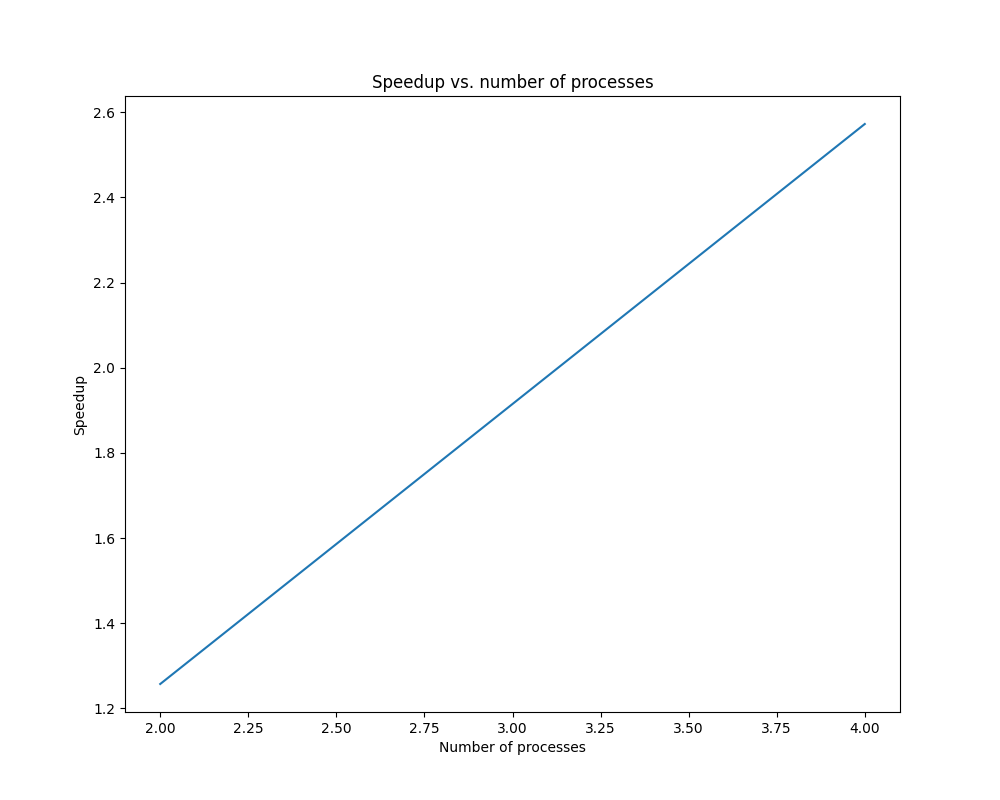
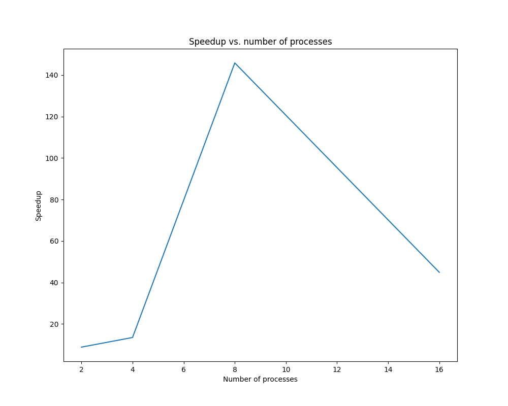

# CPD_PD6

## Ejercicio 1

```
mpirun -np 6 ./ex1-adivina.out
```

## Ejercicio 2

a) DAG de la funcion `OpVec()`:


Donde:

- (0) raiz del dag.
- (1) calculo a. `O(n^2)`
- (2) calculo b.`O(n^2)`
- (3) calculo c.`O(n^2)`
- (4) primer for.`O(n^2)`
- (5) segundo for.`O(n^2)`
- (6) calculo final. `O(n)`

b) El codigo paralelizado se encuentra en `ex2/`

c) La complejidad del algoritmo secuencial es `O(n^2)`, por lo visto en la parte a). La complejidad del algoritmo en paralelo sigue siendo `O(n^2)`. El speedup seria `O(1)`.

## Ejercicio 3

a) Genere una grafica velocidad vs. numero de procesos en MPI, para np=2,4,8,16



b) Paralelice la multiplicacion matriz-vector con OMP, y genere una grafica velocidad vs. numero de threads, para nthreads=2,4,8,16



c) Paralelice la multiplicacion matriz-vector con MPI+OMP, y compare en una grafica velocidad vs. numero de procesos, las curvas para np=4,8,16 y nthreads = 4,8, con los correspondientes modelos en MPI (np=4,8,16)

d) Comente los resultados y decida sobre la utilidad de implementar un modelo hibrido para este problema

En ambas de graficas de los puntos a (MPI) y b (OMP) se observa una relacion directamente proporcional entre el speedup y el numero de procesadores. Esto es mas notable con OMP.
