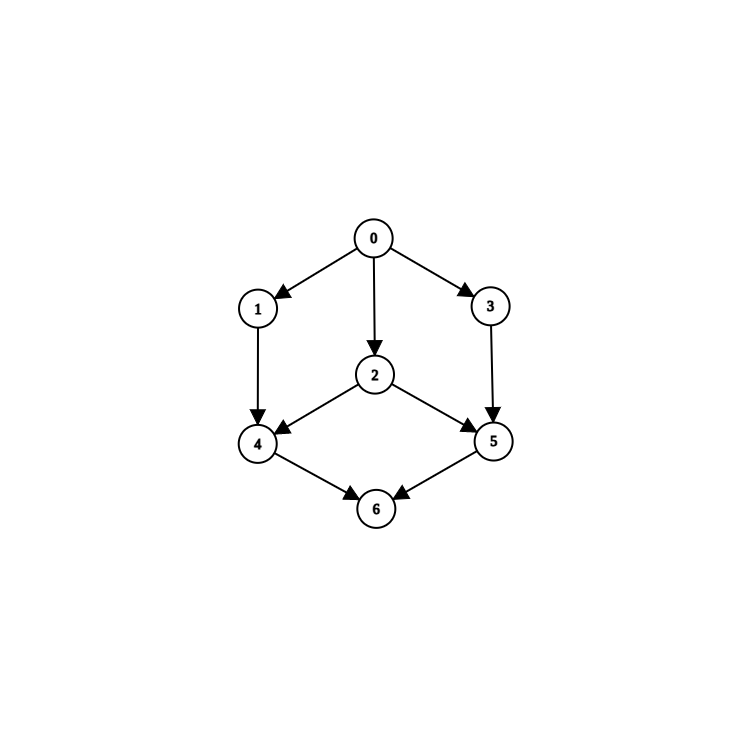

# CPD\_PD6

## Ejercicio 1

```
mpirun -np 6 ./ex1-adivina.out
```

## Ejercicio 2


a) DAG de la funcion `OpVec()`:



Donde:
- (0) raiz del dag.
- (1) calculo a. `O(n^2)`
- (2) calculo b.`O(n^2)`
- (3) calculo c.`O(n^2)`
- (4) primer for.`O(n^2)`
- (5) segundo for.`O(n^2)`
- (6) calculo final. `O(n)`

b) El codigo paralelizado se encuentra en `ex2/`

c) La complejidad del algoritmo secuencial es `O(n^2)`, por lo visto en la parte a). La complejidad del algoritmo en paralelo sigue siendo `O(n^2)`. El speedup seria `O(1)`.
